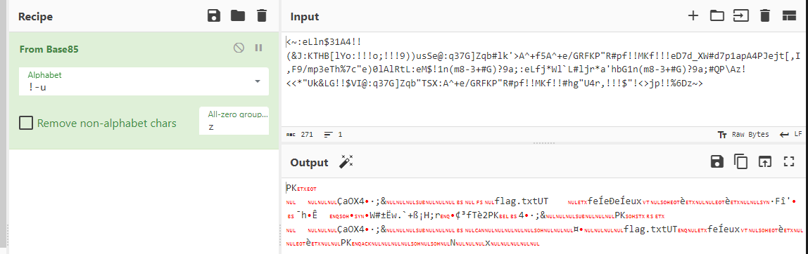
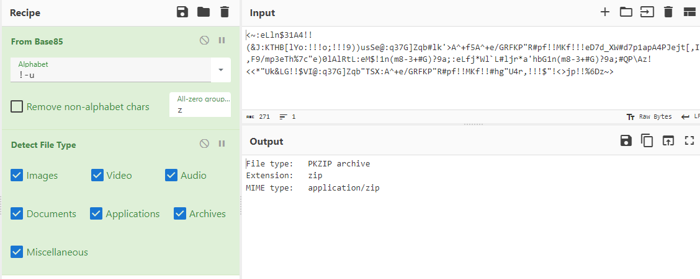
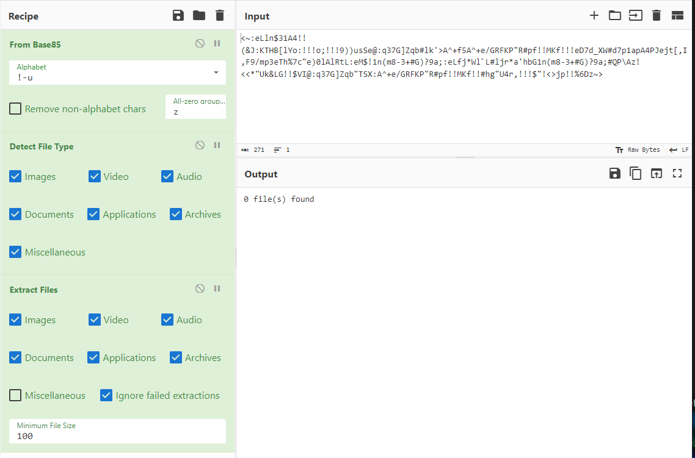
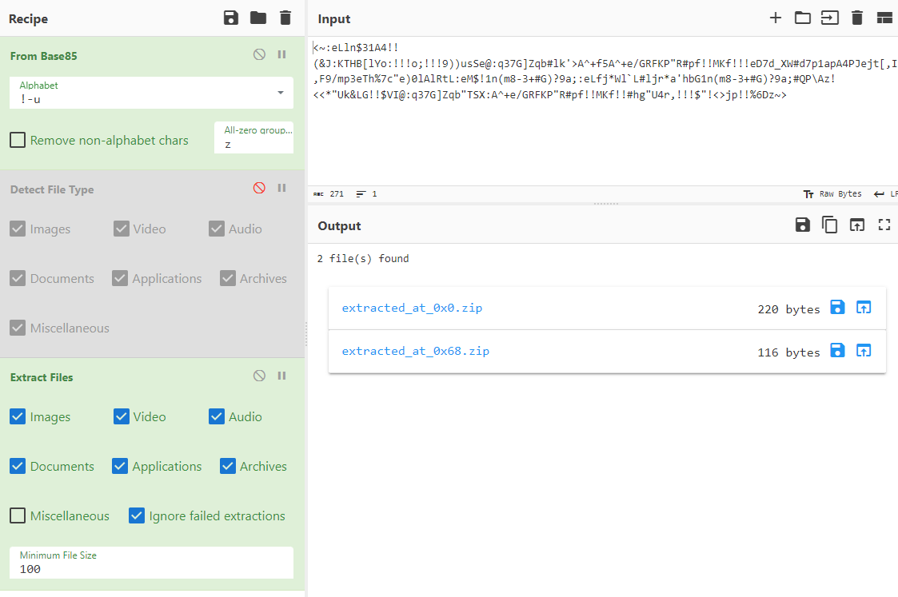
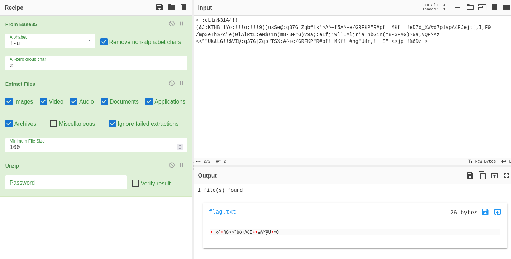
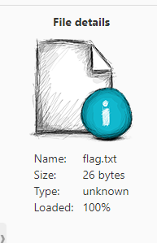
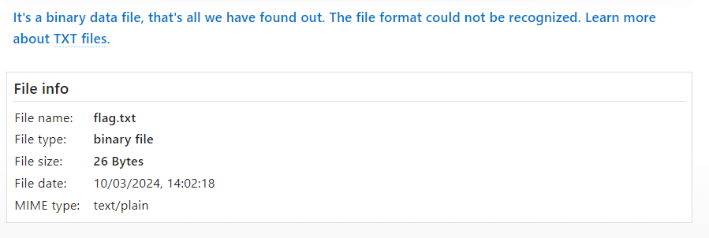

String to decode:

    <~:eLln$31A4!!(&J:KTHB[lYo:!!!o;!!!9))usSe@:q37G]Zqb#lk'>A^+f5A^+e/GRFKP"R#pf!!MKf!!!eD7d_XW#d7p1apA4PJejt[,I,F9/mp3eTh%7c"e)0lAlRtL:eM$!1n(m8-3+#G)?9a;:eLfj*Wl`L#ljr*a'hbG1n(m8-3+#G)?9a;#QP\Az!<<*"Uk&LG!!$VI@:q37G]Zqb"TSX:A^+e/GRFKP"R#pf!!MKf!!#hg"U4r,!!!$"!<>jp!!%6Dz~>

This is ascii85 (aka base85).

Pasted into CyberChef and selected From Base85:

Not particularly helpful, but I can see there's something called flag.txt. Is there a hidden .txt file?

Added the Detect File Type module from CyberChef:

There are zip files? Maybe we can extract them?

No dice. Hmm... oh, forgot to pause the detect file type module... derp

There are 2 zip files! I'll just use the unzip function in CyberChef...

1 file found! Maybe it contains the flag? CyberChef indicates it's an unknown file type:

Ran a [scanner](https://filext.com/online-file-viewer.html) on the file and it says it's binary with an unknown format.

Maybe if I change the extension to .bin:
