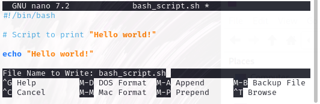

Work in Progress

# Beginner Bash Script

This is a guide for creating and running your first **bash script** using Linux.

## 1. Open the terminal

## 2. Create new bash script file

You can do this using the following command:

    nano bash_script.sh

The nano editor should open up a new file. You may also use other editors such as vim.

## 3. Type the following line at the very top of the file:

    #!/bin/bash

This is the first line in any bash script, and is necessary because it tells the terminal that it should use bash when you run it.

## 4. Type in a command

For this exercise, we will simply output the text "Hello world!" using the following:

    echo "Hello world!"

## 5. Add comments

It is often helpful to add comments so that you can remember what the script is doing. Although this is not compulsory, it is highly recommended, particularly if you are creating a long and complicated script.

You can add comments using # and any text after it will not execute. For example:

    # Script to print "Hello world!"

**_The final script should look like this:_**

    #!/bin/bash

    # Script to print "Hello world!"

    echo "Hello world!"

## 6. Save and close the file

Nano will save to the directory you are in unless you specify a different location. To save a file do the following:

<kbd>Ctrl</kbd>+<kbd>O</kbd> will open the save prompt, it will look something like this:

You will notice at the bottom it says:

    File Name to Write: bash_script.sh

If you want to save to current directory, simply hit the <kbd>Enter</kbd> key.

If you want to save to a specific directory, type in the filepath before the filename as follows:

    File Name to Write: /home/username/Documents/bash_script.sh

Hit the <kbd>Enter</kbd> key and it will ask you if you want to save the file under a different name. Type <kbd>Y</kbd> to agree and hit <kbd>Enter</kbd> again.

To exit the file, use <kbd>Ctrl</kbd>+<kbd>X</kbd>.

## 7. Make the file executable

The script cannot be run yet, it will need permissions to execute. Use the following command:

    chmod +x hello_world.sh
