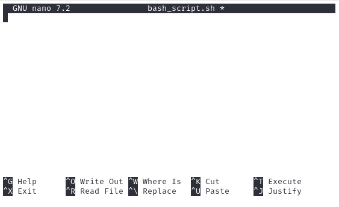
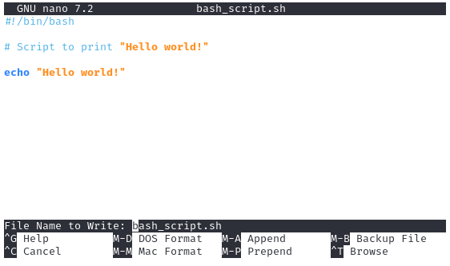
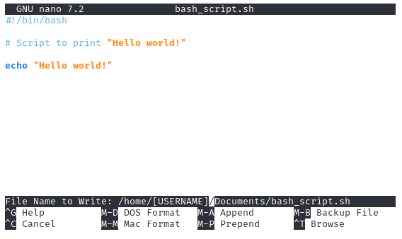
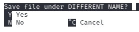

Work in Progress

# Beginner Bash Script

This is a guide for creating and running your first **bash script** using Linux.

## 1. Open the terminal

## 2. Create new bash script file

You can do this using the following command:

    nano bash_script.sh

Note that the extension `.sh` denotes that this is a bash script. Using another extension will change the file format.

The nano editor should open up a new file. You may also use other editors such as vim, but keep in mind the following instructions may be specific to nano.

## 3. Shebang

A [Shebang](<https://en.wikipedia.org/wiki/Shebang_(Unix)#:~:text=In%20computing%2C%20a%20shebang%20is,the%20beginning%20of%20a%20script>) tells the computer which interpreter to use when running the script and this allows it to **_interpret_** the remaining code correctly.

Without this line, the script will still run on Linux machines, because it will refer to the default interpreter which is bash. If the system you are using has a different default interpreter, your script may not run.

The Shebang should go at the top of your file.

For a bash script, use the following line:

    #!/bin/bash

## 4. Type in a command

For this exercise, we will simply output the text "Hello world!" using the following:

    echo "Hello world!"

## 5. Add comments

It is often helpful to add comments so that you can remember what the script is doing. Although this is not compulsory, it is highly recommended, particularly if you are creating a long and complicated script.

You can add comments using # and any text after it will not execute. For example:

    # Script to output "Hello world!"

**_The final script should look like this:_**

    #!/bin/bash

    # Script to output "Hello world!"

    echo "Hello world!"

## 6. Save and close the file

Nano will save to the directory you are in unless you specify a different location. To save a file do the following:

<kbd>Ctrl</kbd>+<kbd>O</kbd> will open the save prompt, it will look something like this:

You will notice at the bottom it says:

    File Name to Write: bash_script.sh

If you want to save to current directory, simply hit the <kbd>Enter</kbd> key.

If you want to save to a specific directory, type in the filepath before the filename as follows:

    File Name to Write: /home/[USERNAME]/Documents/bash_script.sh

Hit the <kbd>Enter</kbd> key and it will ask you if you want to save the file under a different name. Type <kbd>Y</kbd> to agree and you file will be saved.

To exit the file, use <kbd>Ctrl</kbd>+<kbd>X</kbd>.

## 7. Make the file executable

The script cannot be run yet, it will need permissions to execute.

If you are not in the same directory you saved the script to, ensure you include the filepath:

    chmod +x /home/username/Documents/bash_script.sh

If you are in the same directory, there is no need to include the filepath:

    chmod +x bash_script.sh

## 8. Run the script

Now you can run the script using the following (if not in the same directory):

    /home/username/Documents/bash_script.sh

Again, if you are already in the same directory, you can forego the filepath, but include a `.` at the beginning:

    ./bash_script.sh

You should now see the output in the terminal:

# You have now created and run your first bash script! What now?

Obviously this is a very beginner script and the actual code itself is simple. In order to write more complex scripts, you will need to have an understanding of bash.

If you want to learn more, try out [TryHackMe Bash Scripting](https://tryhackme.com/room/bashscripting).
