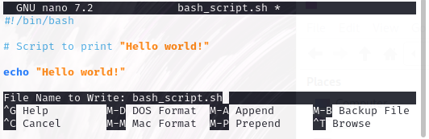

Work in Progress

# Beginner Python Script

This is a guide for creating and running your first **python script** using Linux.

## 1. Open the terminal

## 2. Install Python

Check to see if you have Python installed and the version using the following command:

    python3 -V

If Python is installed, the terminal will output something like this:

    Python 3.10.4

`3.10.4` is the version number. If there is no output, it is not installed and you will need to do this using the following command:

    sudo apt update && sudo apt upgrade
    sudo apt install python3

There are also modules which you can install if you wish. In order to do this, you must install the package manager called `pip`. You can do this using the following command:

    sudo apt install python3-pip

You may install modules using the following syntax:

    pip install [MODULE_NAME]

## 3. Create new Python script file

You can do this using the following command:

    nano python_script.py

Note that the extension `.py` denotes that this is a Python script. Using another extension will change the file format.

The nano editor should open up a new file. You may also use other editors such as vim, but keep in mind the following instructions may be specific to nano.

## 4. Shebang

A [Shebang](<https://en.wikipedia.org/wiki/Shebang_(Unix)#:~:text=In%20computing%2C%20a%20shebang%20is,the%20beginning%20of%20a%20script>) tells the computer which interpreter to use when running the script and this allows it to **_interpret_** the code correctly.

For Python, a Shebang is optional, but you need to include one if you want to be able to execute the script from the command line. More about it [here](https://www.w3docs.com/snippets/python/should-i-put-shebang-in-python-scripts-and-what-form-should-it-take.html).

The Shebang should go at the top of your file. There are two options here:

1.  For a Python script running in **Linux**, use the following line:

        #!/usr/bin/python3

2.  If you want a script to run across **other systems**, use the following line:

        #!/usr/bin/env python3

## 5. Type in a command

For this exercise, we will simply output the text "Hello world!" using the following:

    echo "Hello world!"

## 5. Add comments

It is often helpful to add comments so that you can remember what the script is doing. Although this is not compulsory, it is highly recommended, particularly if you are creating a long and complicated script.

You can add comments using # and any text after it will not execute. For example:

    # Script to print "Hello world!"

**_The final script should look like this:_**

    #!/bin/python

    # Script to print "Hello world!"

    echo "Hello world!"

## 6. Save and close the file

Nano will save to the directory you are in unless you specify a different location. To save a file do the following:

<kbd>Ctrl</kbd>+<kbd>O</kbd> will open the save prompt, it will look something like this:

You will notice at the bottom it says:

    File Name to Write: python_script.py

If you want to save to current directory, simply hit the <kbd>Enter</kbd> key.

If you want to save to a specific directory, type in the filepath before the filename as follows:

    File Name to Write: /home/username/Documents/python_script.py

Hit the <kbd>Enter</kbd> key and it will ask you if you want to save the file under a different name. Type <kbd>Y</kbd> to agree and hit <kbd>Enter</kbd> again.

To exit the file, use <kbd>Ctrl</kbd>+<kbd>K</kbd>.

## 7. Make the file executable

The script cannot be run yet, it will need permissions to execute.

If you are not in the same directory you saved the script to, ensure you include the filepath:

    chmod +x /home/username/Documents/python_script.py

If you are in the same directory, there is no need to include the filepath:

    chmod +x python_script.py

## 8. Run the script

Now you can run the script using the following (if not in the same directory):

    /home/username/Documents/python_script.py

Again, if you are already in the same directory, you can forego the filepath, but include a `.` at the beginning:

    ./python_script.py

# You have now created and run your first python script! What now?

Obviously this is a very beginner script and the actual code itself is very simple. In order to write more complex scripts, you will need to start learning to code, which is a skill that takes time and practice.

But, Python is a great language to learn! It's used across many industries and can be used across many platforms.

If you want to learn more, try [TryHackMe Python Basics](https://tryhackme.com/r/room/pythonbasics).
